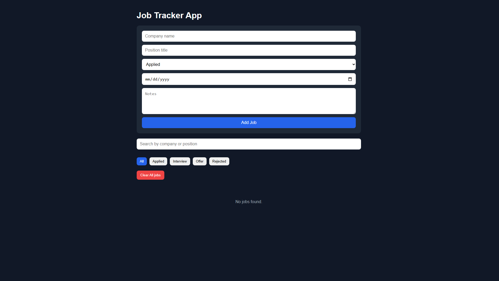

💼 React Job Tracker App

A simple and clean job tracking web app built with React.

🚀 Live Demo

👉 https://kkato0219.github.io/react-job-tracker/

📌 Features
Add job applications
Edit existing jobs
Delete jobs
Filter by status (Applied, Interview, Offer, Rejected)
Search by company or position
Data saved using localStorage
Clear all jobs
Responsive and clean UI
🛠️ Built With
React (Vite)
JavaScript
CSS
📚 What I Learned
React useState & useEffect
Controlled forms
Component structure (JobForm, JobList, JobCard, FilterBar)
Conditional rendering
Array methods (map, filter)
localStorage integration
Basic UI/UX design
📷 Screenshots

()

⚙️ Setup (Local)
npm install
npm run dev
🚀 Deployment

Deployed using GitHub Pages + GitHub Actions.

👤 Author

Kenichi Kato